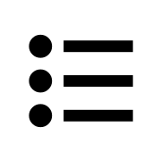

<!-- PROJECT LOGO -->
 

  

<h3 align="center">Todo List</h3>

  

    A simple todo list that uses local storage
     
    <a href="https://github.com/AlphaZer00/todo-list"><strong>Explore the docs »</strong></a>
     
     
    <a href="https://github.com/AlphaZer00/todo-list">View Demo</a>
    ·
    <a href="https://github.com/AlphaZer00/todo-list/issues/new?labels=bug&template=bug-report---.md">Report Bug</a>
    ·
    <a href="https://github.com/AlphaZer00/todo-list/issues/new?labels=enhancement&template=feature-request---.md">Request Feature</a>
  

<!-- TABLE OF CONTENTS -->

  
Table of Contents

  <ol>
    <li>
      <a href="#about-the-project">About The Project</a>
      <ul>
        <li><a href="#built-with">Built With</a></li>
      </ul>
    </li>
    <li>
      <a href="#getting-started">Getting Started</a>
    </li>
    <li><a href="#what-i-learned">What I Learned</a></li>
    <li><a href="#contributing">Contributing</a></li>
    <li><a href="#license">License</a></li>
    <li><a href="#contact">Contact</a></li>
  </ol>

<!-- ABOUT THE PROJECT -->
## About The Project

[![Product Name Screen Shot][product-screenshot]](https://example.com)

(<a href="#readme-top">back to top</a>)

### Built With

* 
* 
* 
* 

(<a href="#readme-top">back to top</a>)

<!-- GETTING STARTED -->
## Getting Started

First start by clicking **"Create New Project"**. 
You can then select **"+ Add Task"** to create a todo list item.
Once an item is created, you can edit it, delete it, and mark it as complete.

<!-- ROADMAP -->
## What I Learned

This project was the largest project I have worked on to date and has taken the most time. Conceptually, it is a basic todo list, but as I continued to develop, more and more ideas for features that felt necessary kept popping up in my head. I had to explore a lot of new tools to get everything working. I had to get used to finding and utilizing javscript libraries. For example, I used date-fns for handling the formatting of due dates, favicons-webpack-plugin to resolve my favicon fiasco (seriously, why can't there just be one standard file type/size that just works on all modern browsers???), and gh-pages for deploying a live version on github on a webpack-based project. That process got me much more comfortable with webpack. 

I made use of local storage for this project. It was my first time experiementing with storage and I had a fun time working it out. One challenge was ensuring that any new task, edits to a task, or deletions were recorded in storage and then properly displayed on page reload. There was a bug where refreshing the page would clone every existing todo list item on the DOM, which was resolved by finding out that two different functions were displaying the stored list items simultaneously. 

A crucial concept that I had in mind from the beginning with this project is that the underlying logic and user interface should be as separate as possible. Essentially, I tried to create as complete of a version of this project as possible that functioned just in the console before working on the UI. The part where i ran into trouble with this concept is that a big part of the project is about creating and editing the todo list objects through user inputs. It became more difficult to avoid creating functions that merged UI elements with underlying application logic.

(<a href="#readme-top">back to top</a>)

<!-- CONTRIBUTING -->
## Contributing

Contributions are what make the open source community such an amazing place to learn, inspire, and create. Any contributions you make are **greatly appreciated**.

If you have a suggestion that would make this better, please fork the repo and create a pull request. You can also simply open an issue with the tag "enhancement".
Don't forget to give the project a star! Thanks again!

1. Fork the Project
2. Create your Feature Branch (`git checkout -b feature/AmazingFeature`)
3. Commit your Changes (`git commit -m 'Add some AmazingFeature'`)
4. Push to the Branch (`git push origin feature/AmazingFeature`)
5. Open a Pull Request

(<a href="#readme-top">back to top</a>)

<!-- LICENSE -->
## License

Distributed under the MIT License. See `LICENSE.txt` for more information.

(<a href="#readme-top">back to top</a>)

<!-- CONTACT -->
## Contact

Batuhan Dasdemir - [LinkedIn][linkedin-url] - batudasdemir@gmail.com

Project Link: [https://github.com/AlphaZer00/todo-list](https://github.com/AlphaZer00/todo-list)

(<a href="#readme-top">back to top</a>)

<!-- MARKDOWN LINKS & IMAGES -->
[issues-shield]: https://img.shields.io/github/issues/AlphaZer00/todo-list.svg?style=for-the-badge
[issues-url]: https://github.com/AlphaZer00/todo-list/issues
[license-shield]: https://img.shields.io/github/license/AlphaZer00/todo-list.svg?style=for-the-badge
[license-url]: https://github.com/AlphaZer00/todo-list/blob/master/LICENSE.txt
[linkedin-shield]: https://img.shields.io/badge/-LinkedIn-black.svg?style=for-the-badge&logo=linkedin&colorB=555
[linkedin-url]: https://www.linkedin.com/in/batuhan-dasdemir
[product-screenshot]: src/assets/project-screenshot.png
